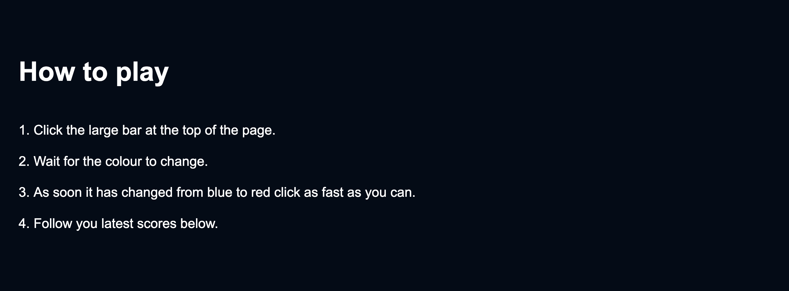
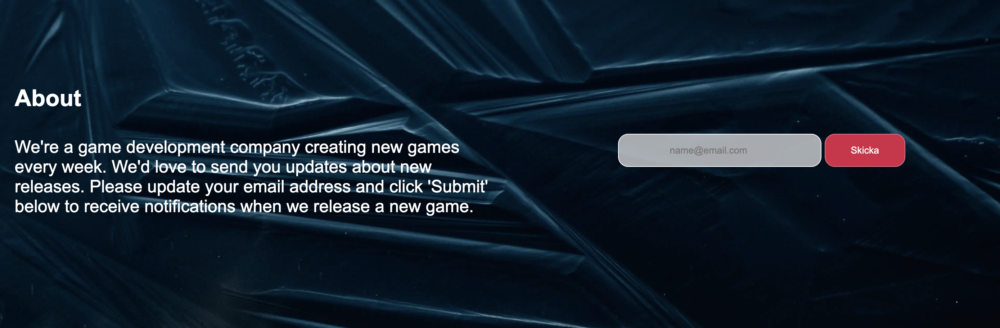
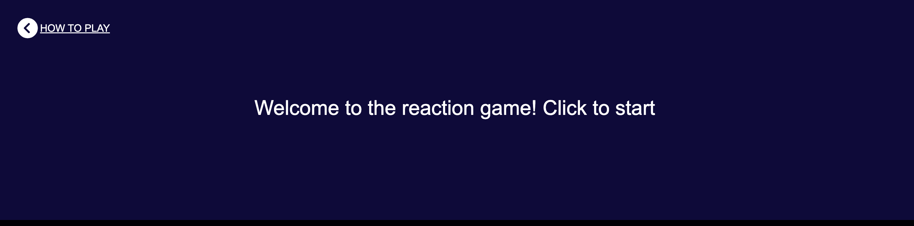
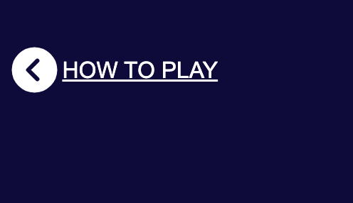
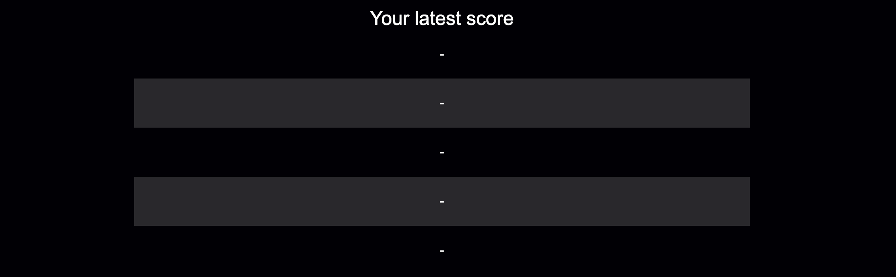

# **Reaction Game**
The reaction game is a game where you can test your reaction ability and try to beat your friends by being able to see the latest score. This game is targeted at everyone because the game is really simple to play for all ages.

## **Features**
The features in this game are created to enhance the user experience.

## **Existing features**
* **Play Now**
    - Featured on the home page, users can easily find and play the game.

* **How to play**
    - Below the hero image and text, you'll find information about how to play the game. The section is structured, so the steps are easy to follow.

* **About & Contact**
    - This section is all about us and our games. You can subscribe to the newsletter to get notified when new games are released.

* **Game Area**
    - This page is where the user plays the game. The large section of this image is displayed at the top of the page. And has text on it that describes what the user should do to start the game. 

* **How to play and back home**
    - If the user doesn't understand how to play, there is a link on the how to play section at the top of the game page. There is also an icon that will redirect the user back to the home page. 

* **Latest Results**
    - This section below the game area shows the latest results of the user's scores. The user can store up to 5 results before the newer scores replace the oldest. 

## **Features left to implement**
- Universal scores, this feature would store the top results of all the users who have played the game.
* Other reaction-type games, one idea is to create a game where the user should type a letter that shows up on the screen. 
+ The site is in different languages.
- Add sound for when the colors change so the visually impaired can play.

## **Testing**
.......................
## **Validator testing**

* **HTML**
    - No errors were shown when passing through the official W3C Html Validator.
* **CSS**
    - No errors were shown when passing through the official Jigsaw CSS Validator.
* **JavaScript**
    - 16 warnings were shown when passing through the official JShint validator, all related to my statements not available in ES6. My mentor said to ignore them. 
        * The follownig metrics were returned:
        * There are 4 functions in this file.
        * Function with the largest signature take 1 arguments, while the median is 0.
        * Largest function has 6 statements in it, while the median is 4.
        * The most complex function has a cyclomatic complexity value of 2 while the median is 1.5.

## **Unfixed Bugs**
There are no unfixed bugs relating to the functionality of the website. But regarding to the Jshint validator showing errors could be a bug that should be fixed.

